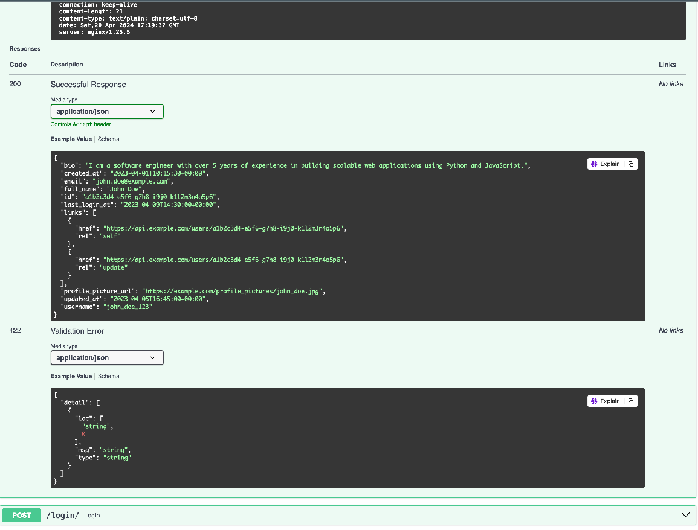
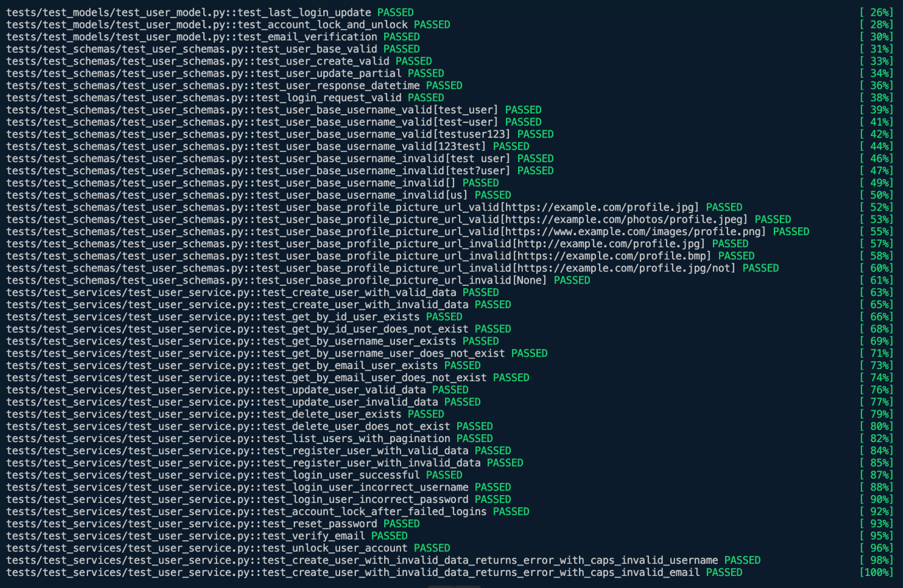
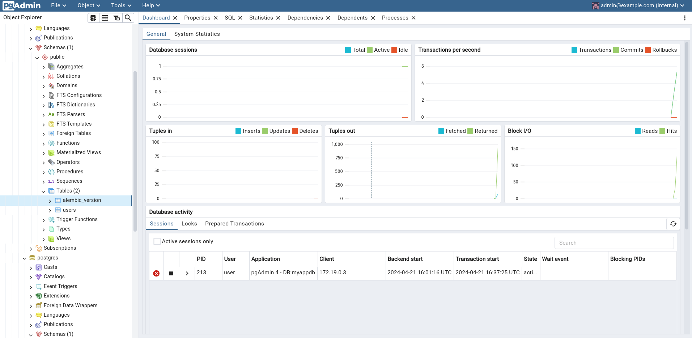

# Haren Chowdary Doppalapudi | hd337

## Event Manager Company: Software QA Analyst/Developer Onboarding Assignment.
Fastapi is now operational after completing the setup and installation instructions.

## Setup 
Ensure that the github activities and Docker hub tokens are up to current, and that image builds are triggered as needed.
The following are the changes that address it.: 

## Testing and Database Management

Testing the application for test cases; everything is up and running with no problems.

Database created and accessed via PGAdmin.

## Specific Issues to Address
## All the issues handled and fixed according to the standards:

1. **authentication mismatch**:
Issue Link: https://github.com/haren0612/event_manager_homework10/issues/1
PR Link: https://github.com/haren0612/event_manager_homework10/pull/

2. **Email standardization**:
Issue Link: https://github.com/haren0612/event_manager_homework10/issues/3
PR Link: https://github.com/haren0612/event_manager_homework10/pull/4

3. **profile picture protocol**: 
Issue Link: https://github.com/haren0612/event_manager_homework10/issues/8
PR Link: https://github.com/haren0612/event_manager_homework10/pull/9

4. **standardized username**:
Issue Link: https://github.com/haren0612/event_manager_homework10/issues/10
PR Link: https://github.com/haren0612/event_manager_homework10/pull/11

5. **validation of user length**:
Issue Link: https://github.com/haren0612/event_manager_homework10/issues/5
PR Link: https://github.com/haren0612/event_manager_homework10/pull/7

6. **password validation**:
Issue Link: https://github.com/haren0612/event_manager_homework10/issues/12
PR Link: https://github.com/haren0612/event_manager_homework10/pull/13

## Submission Requirements

Aside from the links for issues and PRs stated above, locate the other links needed below:

- Links to the closed issues: https://github.com/haren0612/event_manager_homework10/issues?q=is%3Aissue+is%3Aclosed
- Link to project image deployed to Dockerhub: https://hub.docker.com/repository/docker/haren0612/homework10/general
- Link to successfull CI/CD: 
